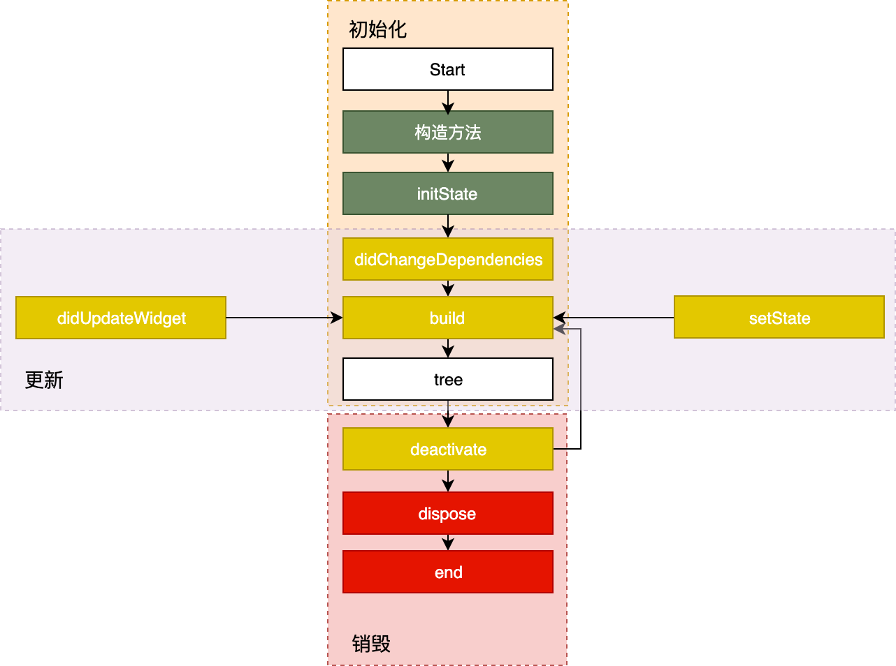
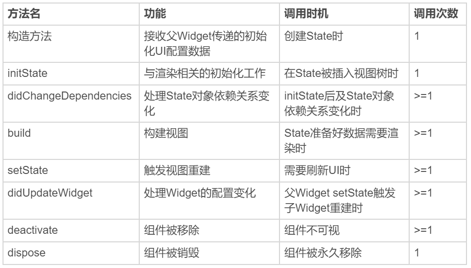

# Flutter

## Widget
Flutter核心设计思想是"一切皆是Widget", Widget是flutter功能的抽象描述, 是视图的配置信息, 也是数据的映射. 

Widget渲染过程:  Flutter会结构化地组织视图数据, 提供渲染引擎完成界面显示. 视图的组织和渲染被抽象为三部分.
   * `Widget`: Widget是对视图的一种结构化描述，是控件实现的基本逻辑单位，里面存储的是有关视图渲染的配置信息，包括布局、渲染属性、事件响应信息等。Widget被设计为**不可变**, 当视图渲染的配置信息发生变化时, flutter会选择重新构建Widget树的方式进行数据更新, 以数据驱动UI更新. 缺点是，因为涉及到大量对象的销毁和重建，所以会对垃圾回收造成压力。不过，Widget 本身并不涉及实际渲染位图，所以它只是一份轻量级的数据结构，重建的成本很低。
   * `Element`: Element是Widget的一个**可变的**实例化对象，它承载了视图构建的上下文数据，是连接结构化的配置信息到完成最终渲染的桥梁。 **Element 树这一层将 `Widget` 树的变化（类似 React 虚拟 DOM diff）做了抽象，可以只将真正需要修改的部分同步到真实的 RenderObject 树中，最大程度降低对真实渲染视图的修改，提高渲染效率，而不是销毁整个渲染视图树重建。**
   * `RenderObject`: 包含视图渲染信息的对象. 渲染对象树在 Flutter 的展示过程分为四个阶段，即布局、绘制、合成和渲染。 其中，布局和绘制在 RenderObject 中完成，Flutter 采用深度优先机制遍历渲染对象树，确定树中各个对象的位置和尺寸，并把它们绘制到不同的图层上。绘制完毕后，合成和渲染的工作则交给 Skia 搞定。
4333
渲染过程可分为三步:
1. 通过`Widget`树生成对应的`Element`树.
2. 创建相应的 `RenderObject` 并关联到 `Element.renderObject` 属性上.
3. 构建成 `RenderObject` 树，以完成最终的渲染。

## StatelessWidget 和 StatefulWidget
Flutter视图开发使用`声明式`UI编程范式, 其核心设计思想就是将视图和数据分离, 与React的设计思路一致. 与传统命令式iOS视图开发(非SwiftUI)区别在于, 命令式编程强调精确控制过程细节, 而声明式编程强调通过意图输出结果整体. 例如传统的通过操作dom开发和Vue开发的区别.

`StatelessWidget`: 在创建时, 处理配置参数外不依赖其他任何信息. 一旦创建成功就不关心也不响应任何数据变化进行重绘.

`StatefulWidget`: 创建完成后, 需要关心和相应数据的变化来进行重绘.

`StatefulWidget`是以 `State` 类代理 Widget 构建的设计方式实现的, 由其负责视图的构建. 

**注意点: **

* 需要合理使用`StatefulWidget` 和 `StatefulWidget`，滥用`StatefulWidget`会直接影响 `Flutter` 应用的渲染性能。`Widget` 是不可变的，更新则意味着销毁 + 重建（build）。
`StatelessWidget` 是静态的，一旦创建则无需更新；而对于 `StatefulWidget` 来说，在 `State` 类中调用 `setState` 方法更新数据，会触发视图的销毁和重建，也将间接地触发其每个子 Widget 的销毁和重建。 尽管 `Flutter` 会通过 `Element` 层去最大程度降低对真实渲染视图的修改，但大量的 `Widget` 销毁重建无法避免，因此避免 `StatefulWidget` 的滥用，是最简单、直接地提升应用渲染性能的手段。

* 由于 Widget 采用由父到子、自顶向下的方式进行构建，因此在自定义组件时，我们可以根据父 Widget 是否能通过初始化参数完全控制其 UI 展示效果的基本原则，来判断究竟是继承 `StatelessWidget` 还是 `StatefulWidget`。
* 除了我们主动地通过 `State` 刷新 UI 之外，在一些特殊场景下，`Widget` 的 `build` 方法有可能会执行多次。因此，我们不应该在这个方法内部，放置太多有耗时的操作。

## 生命周期
### Widget的State生命周期: 

State 的生命周期可以分为 3 个阶段：创建（插入视图树）、更新（在视图树中存在）、销毁（从视图树中移除）. `构造方法` -> `initState` -> `didChangeDependencies` -> `build`，随后完成`页面渲染`。

**创建:**
* `构造方法`: `State` 生命周期的起点， `Flutter` 会通过调用 `StatefulWidget.createState()` 来创建一个 `State`。我们可以通过构造方法，来接收父 `Widget` 传递的初始化 `UI` 配置数据。这些配置数据，决定了 `Widget` 最初的呈现效果。
* `initState`: `State` 对象被插入视图树的时候调用。这个函数在 State 的生命周期中只会被调用一次，所以我们可以在这里做一些初始化工作，比如为状态变量设定默认值。
* `didChangeDependencies`: 用来专门处理 `State` 对象依赖关系变化，会在 `initState()` 调用结束后，被 `Flutter` 调用。
* `build`: 作用是构建视图。经过以上步骤，Framework 认为 `State` 已经准备好了，于是调用 `build`。我们需要在这个函数中，根据父 `Widget` 传递过来的初始化配置数据，以及 State 的当前状态，创建一个 `Widget` 然后返回。

**更新:**

Widget 的状态更新，主要由 3 个方法触发：`setState`、`didchangeDependencies` 与 `didUpdateWidget`。一旦这三个方法被调用，`Flutter` 随后就会销毁老 `Widget`，并调用 `build` 方法重建 `Widget`。

* `setState`：我们最熟悉的方法之一。当状态数据发生变化时，我们总是通过调用这个方法告诉 `Flutter`：“我这儿的数据变啦，请使用更新后的数据重建 UI！”
* `didChangeDependencies`：`State` 对象的依赖关系发生变化后，`Flutter` 会回调这个方法，随后触发组件构建。哪些情况下 `State` 对象的依赖关系会发生变化呢？典型的场景是，系统语言 Locale 或应用主题改变时，系统会通知 `State` 执行 `didChangeDependencies` 回调方法。
* `didUpdateWidget`：当 `Widget` 的配置发生变化时，比如，父 `Widget` 触发重建（即父 `Widget` 的状态发生变化时），热重载时，系统会调用这个函数。

总结:

### App生命周期

## 布局

单子Widget布局：`Container`、`Padding` 与 `Center`.
多子Widget布局：`Row`、`Column` 与 `Expanded`.

注意点:
`Row` 与 `Column` 自身的大小由父widget的大小、子widget的大小、以及mainSize设置共同决定（mainAxisSize和crossAxisSize)
-主轴（纵轴）值为max：主轴（纵轴）大小等于屏幕主轴（纵轴）方向大小或者父widget主轴（纵轴）方向大小
-主轴（纵轴）值为min： 所有子widget组合在一起的主轴（纵轴）大小

